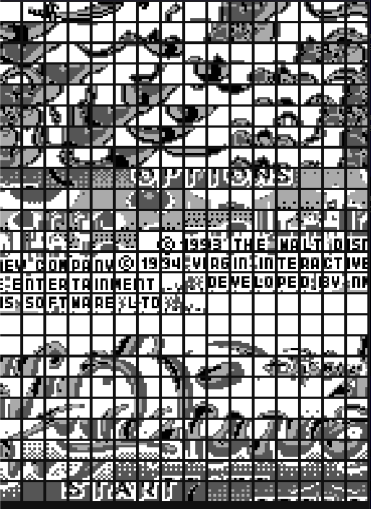
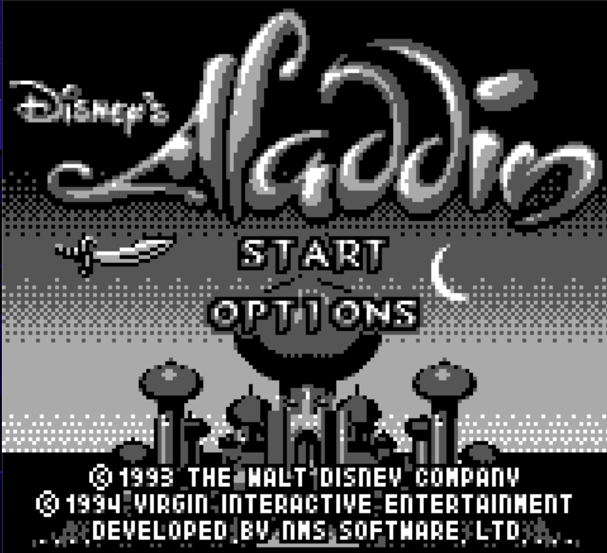

# Game Boy Emulator (gbemu)

A high-performance Game Boy (DMG) and Game Boy Color (CGB) emulator written in C using SDL2.

<p align="center">
  
  
</p>

## Features

- **DMG & CGB Support**: Full emulation of both original Game Boy and Game Boy Color hardware.
- **Graphics**: Robust PPU implementation with support for tile flipping and VRAM banking (CGB).
- **Audio**: APU implementation for classic Game Boy sound.
- **Memory**: Support for common Memory Bank Controllers (MBC1, MBC2, MBC3, MBC5).
- **Debug View**: Real-time tile debugger window to visualize VRAM.
- **Keyboard Input**: Responsive controls via SDL2.

## Dependencies

Before building, ensure you have the following installed:
- **CMake** (v3.10+)
- **SDL2**
- **SDL2_ttf**
- **PkgConfig**
- **Check** (for unit tests)

On macOS (via Homebrew):
```bash
brew install sdl2 sdl2_ttf pkg-config check
```

## Building

To build the project, follow these steps:

1. Clone the repository.
2. Navigate to the `emulator` directory.
3. Run CMake and build:

```bash
cmake .
make
```

The main executable will be generated at `./gbemu/gbemu`.

## Usage

Run the emulator by providing the path to a ROM file:

```bash
./gbemu/gbemu <path_to_rom>
```

## Controls

| Game Boy Button | Keyboard Key |
|-----------------|--------------|
| **Up**          | `W` / `Up Arrow` |
| **Down**        | `S` / `Down Arrow` |
| **Left**        | `A` / `Left Arrow` |
| **Right**       | `D` / `Right Arrow` |
| **A**           | `K` / `Z` |
| **B**           | `J` / `X` |
| **Start**       | `Return` (Enter) |
| **Select**      | `Tab` / `Space` |
| **Exit**        | `Escape` |

## Tests

To run the unit tests:

1. Build the project.
2. Run the test executable:

```bash
./tests/check_gbe
```
